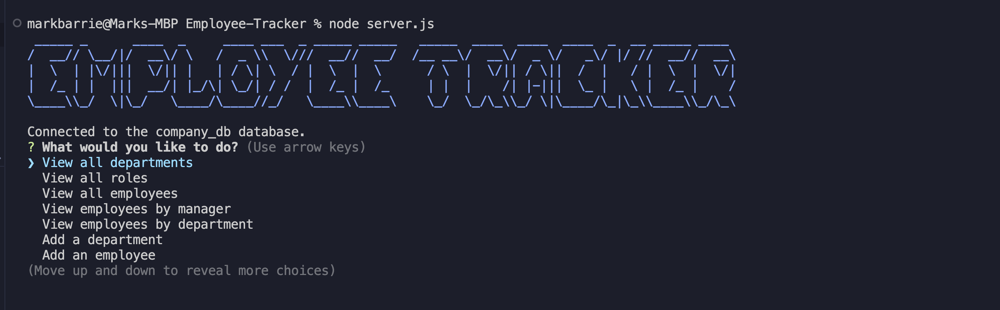
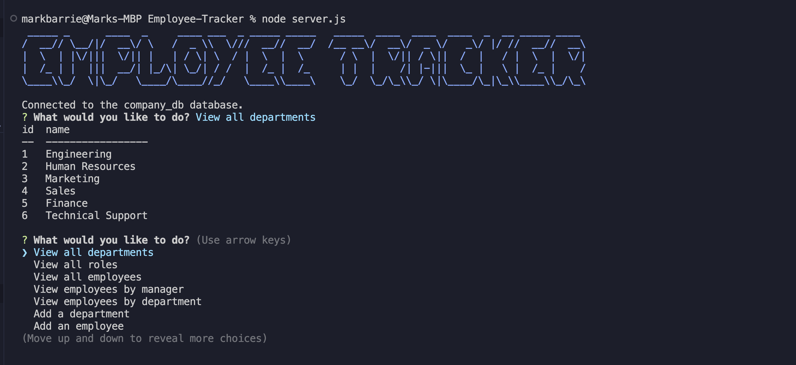
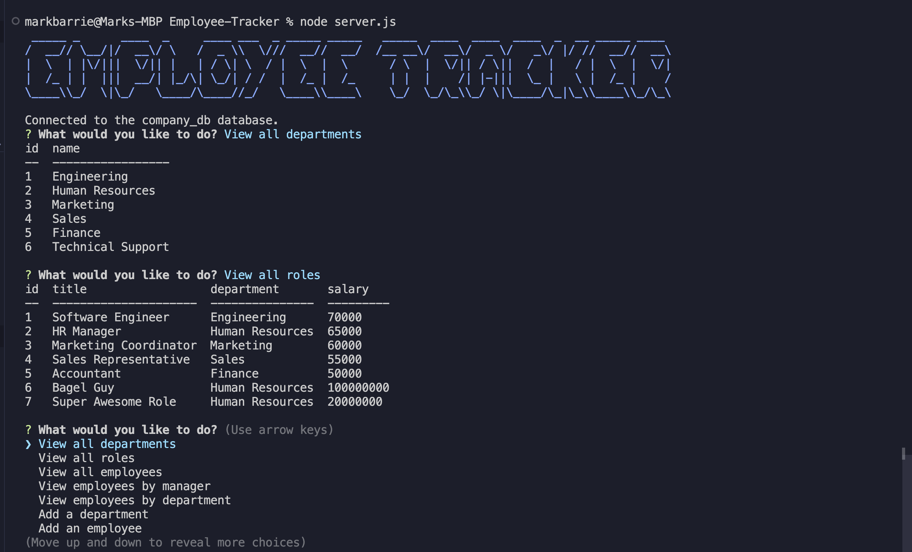
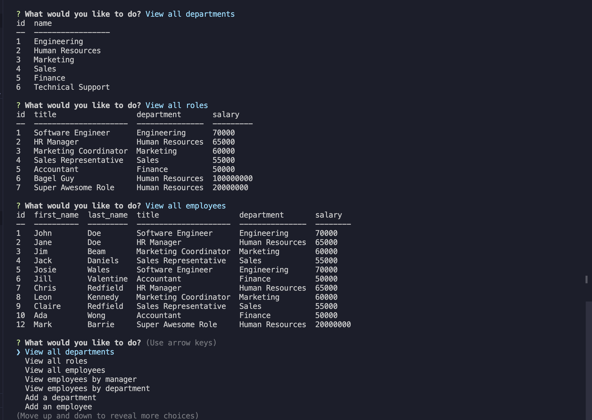

# Employee Tracker

## Description

Employee Tracker is a command-line application that allows users to manage a company's employees using node, inquirer, and MySQL.

## Table of Contents

- [Installation](#installation)
- [Usage](#usage)
- [Features](#features)
- [Screenshots](#screenshots)
- [Walkthrough Video](#walkthrough-video)
- [Contributing](#contributing)
- [Questions](#questions)

## Installation

To install the necessary dependencies, run the following command:
npm install

## Usage

After installing the dependencies, run the application with:
node server.js

This starts the application and presents a series of options to manage departments, roles, and employees within the company database.

## Features

- View all departments, roles, and employees
- Add departments, roles, and employees
- Update employee roles and managers
- Delete departments, roles, and employees
- View employees by manager or department
- View the total utilized budget of a department

## Screenshots

## Walkthrough Video

[Click here for the walkthrough video.](https://app.screencastify.com/v3/watch/vMKLDu6yMziy5p1eew5X)

## Contributing

Contributions are welcome. Please open an issue or submit a pull request with any suggestions.

## Questions

If you have any questions about the repo, open an issue or contact me directly. You can find more of my work at [mbarrie1979](https://github.com/mbarrie1979/).

